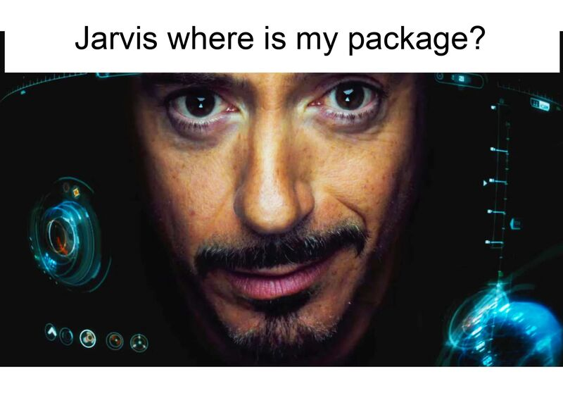
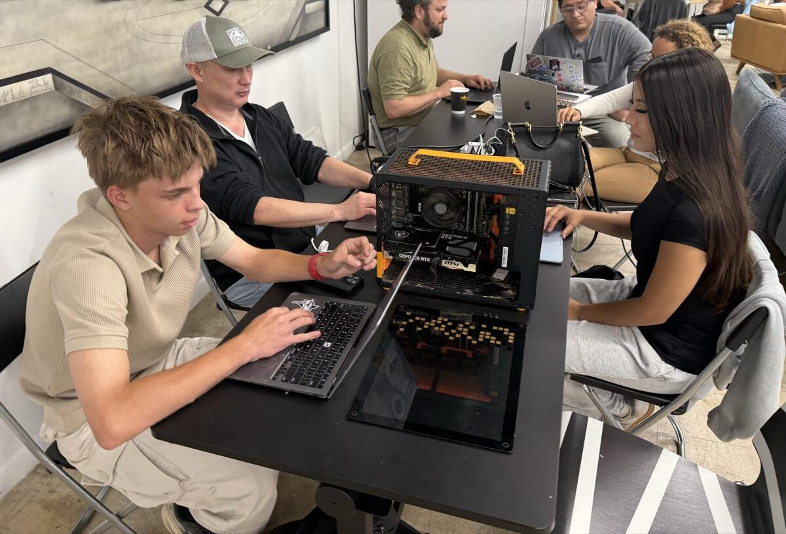
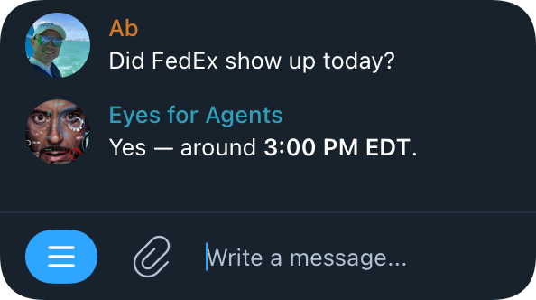
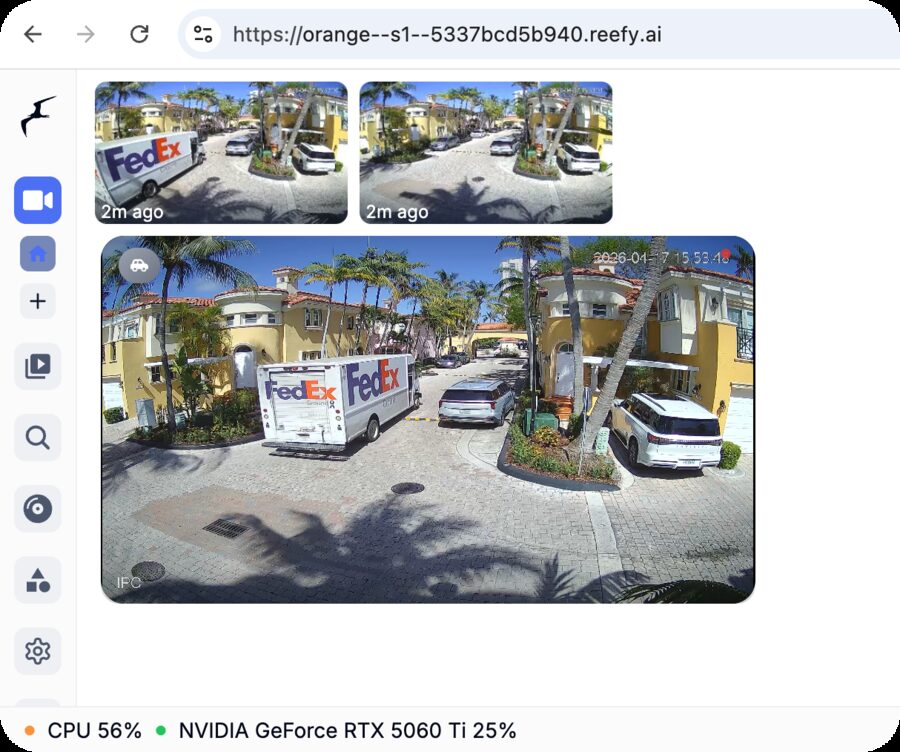

# Eyes for Agents

**Give your AI agents eyes on the physical world.**

> 🥈 **2nd place at the [Miami eMerge AI Hackathon](https://luma.com/1vlz4g39), Apr 2026**


Today's AI agents live entirely on the internet. They write code, send
emails, place orders, book flights, manage calendars - but they're
strangers to the actual world outside your browser tab. They can't see
the FedEx truck in your driveway, or the raccoon raiding your trash.

`eyes-for-agents` is a bridge from cameras to agents. It watches your
existing security cameras (via [Frigate](https://frigate.video)),
notices any activity, asks Google's latest
[Gemma 4](https://ai.google.dev/gemma) vision model to describe what it
sees in plain language, and feeds that description straight into your
[OpenClaw](https://github.com/openclaw/openclaw) agent's memory. Your
agent now knows when the package was actually delivered, when the dog
escaped the yard, when a stranger lingered too long at the gate.

Think **Tony Stark's JARVIS, but for your HOA**. (Sorry Karen.)
<p align="center">
  
</p>

**It runs entirely on your hardware.** Frames go to a local GPU running
[Ollama](https://ollama.com) with [Gemma 4](https://ai.google.dev/gemma).
Nothing leaves the building - no cloud vision API, no one training on
your footage, no big brother.

## Built for the [Miami eMerge AI Hackathon](https://luma.com/1vlz4g39) - 🥈 2nd place

We stitched together a few cutting-edge open pieces into something that
actually does the job:

- **[OpenClaw](https://github.com/openclaw/openclaw)** - the AI agent
  that hears about events and decides what to do (notify, log, act).
- **[Gemma 4](https://ai.google.dev/gemma)** (via Ollama) - the latest
  small multimodal model from Google DeepMind, doing the visual
  understanding locally on a consumer GPU.
- **[YOLO](https://docs.ultralytics.com/) (via Frigate)** - real-time
  object detection on raw camera frames, also on the local GPU,
  triggering events that are worth describing.
- **eyes-for-agents** (this repo) - the orchestration glue. An embedded
  MQTT broker, an event subscriber, clip-fetch + frame-sample logic, a
  prompt that tells the LLM what to focus on, and a Markdown writer
  that drops one report per event.

We built this for our own HOA community manager, who is tired of
answering the same questions all day - "Did the trash truck come
already?", "Is the pool too crowded to come down for a sunbath?".
With cameras already in place, the agent now answers these from real,
live context instead of someone walking outside to look. All running
on premise.

<p align="center">
  
  <br>
  <em>Our team during the hackathon window - hacking on this repo around our
  custom-built GPUter (Nvidia RTX 5060 Ti 16GB) we brought to do all the
  vision inference locally.</em>
</p>

## Demo

The interface is a **Telegram (or WhatsApp) bot** wired to OpenClaw. Ask
the agent anything about what's happened around the community that day
and it answers from real camera events. No timeline scrubbing, no
guessing. Just ask.

<p align="center">
  
</p>

The user just asks a question. Behind the scenes the agent calls
`search_events("FedEx")` over MCP and answers from a real event - no
custom plumbing, no hardcoded "delivery vehicle" heuristic, no training:

<p align="center">
  
  <br>
  <em>The underlying camera footage as it appears in Frigate's web UI.</em>
</p>

When Frigate finalized the event, eyes-for-agents pulled the clip,
sampled **10 frames evenly spaced across the duration** with ffmpeg,
downscaled each to 640px on the longer side, base64-encoded them, and
sent **all 10 in a single Ollama `/api/chat` request** (Ollama's chat
API takes a list of images on one user message, so the model reasons
over the whole sequence at once instead of frame-by-frame).

Below is exactly what Gemma 4 returned for that 10-frame batch -
verbatim from the eyes-for-agents log:

```
[event] model says:
These images show the same scene, captured from multiple slightly different angles, focusing on a paved outdoor area lined with residential buildings and parked vehicles.

Here is a detailed description of what is visible:

**Setting and Environment:**

*   **Architecture:** The background features several low-rise buildings with warm, yellow/ochre-colored stucco walls and light-colored trim. The style suggests a warm, possibly Mediterranean or tropical location.
*   **Paving:** The ground is covered with light-colored pavers, creating a neat driveway or parking area.
*   **Landscaping:** Abundant palm trees are visible, adding a tropical feel to the scene.
*   **Atmosphere:** The lighting is bright, indicating a sunny day.

**Key Objects:**

*   **FedEx Truck:** The most prominent feature is a large white semi-truck or trailer parked on the left side of the frame. It is clearly branded with the logo and text **"FedEx Ground."**
*   **Vehicles:** Several modern passenger vehicles (SUVs and cars, mostly dark colors) are parked in the paved area, situated between the truck and the residential buildings.
*   **Roadway:** The area functions as a driveway or a parking lane leading between the parked cars and the buildings.

**Timestamp:**

All images share a consistent timestamp: **2026-04-17 15:XX**, indicating the time and date the photo was taken.

**In summary, the images depict a sunny, outdoor parking or driveway area set against a backdrop of yellow residential buildings, featuring a FedEx Ground truck and several parked cars.**
```

The full prompt we sent alongside those 10 frames is intentionally
plain:

> Describe what you see on these images

That's it. No "look for delivery vehicles", no "list every brand visible",
no FedEx-specific instruction. The model **picked up the FedEx truck on
its own** - reading the "FedEx Ground" branding straight off the side of
the trailer, no custom training, no rule list. That's the line OpenClaw
later finds via `search_events("FedEx")` when asked the question.

## How it works

```
            [CCTV Camera]
                 │  RTSP
                 ▼
            [Frigate]
                 │  MQTT (frigate/events)
                 ▼
   ┌────────────────────────────┐
   │  eyes-for-agents            │
   │   - embedded MQTT broker    │
   │   - ffmpeg frame sampler    │
   │   - Ollama / Gemma 4 vision │
   │   - MCP server  :1884       │
   └────────────────────────────┘
                 │  MCP (list_events / get_event / search_events)
                 ▼
            [OpenClaw]
                 │
                 ▼
            the user
```

A single Python script:

- Embeds a tiny MQTT broker so Frigate can publish events directly to it
  (no separate broker needed).
- Subscribes to `frigate/events` and processes each finalized event.
- Pulls the clip from Frigate's HTTP API and samples N frames with ffmpeg.
- Asks a local Ollama vision model to describe what's happening.
- Writes one Markdown report per event AND exposes them over an MCP server
  on port 1884 for any agent to query in real time.

## Why Frigate?

Cameras stream 24/7 at ~25 fps. A modern vision LLM like Gemma 4 takes
many seconds per inference - sending it every frame is impossibly
expensive (and 99% of the footage is just shadows shifting and leaves
moving anyway). [Frigate](https://frigate.video) does the cheap part
first: it runs a YOLO detector on the GPU at full frame rate to spot
moments worth a second look - a person
walking up, a car arriving, an animal in the yard. Only then does it
finalize an "event" with a clip, and only then does eyes-for-agents
hand those frames to Gemma 4 for a real description. Cheap detector
filters; expensive describer narrates.

## Why MQTT (not polling)?

Polling Frigate's `/api/events` works but is unreliable: bursts of
events overflow the 25-event window, the script can't tell when a clip
is finalized, and missed events stay missed. Frigate's MQTT `events`
stream fires exactly once per finalized event with the full event
object in the payload.

## Install

```bash
# (Debian/Ubuntu only - skip if your distro ships venv)
sudo apt install -y python3.11-venv

python3 -m venv .venv
. .venv/bin/activate
pip install -r requirements.txt
```

You also need `ffmpeg` and `ffprobe` on PATH (or pass `--ffmpeg` /
`--ffprobe`).

## Configure Frigate

Add this to your Frigate `config.yml` and restart Frigate:

```yaml
mqtt:
  enabled: true
  host: <ip-of-this-script>   # 127.0.0.1 if same container, else host IP
  port: 1883
```

## Run

```bash
./eyes-for-agents.py \
    --frigate-url http://127.0.0.1:5000 \
    --ollama-url  http://ollama:11434 \
    --model       gemma4:e2b
```

(Markdown reports land in `./events/` by default; override with `--out-dir`.
The MCP server reads from the same directory, so any agent stays in sync.)

The script:

1. Starts an MQTT broker on `0.0.0.0:1883`.
2. Subscribes to `frigate/events` on its own broker.
3. Backfills events finalized in the last 10 minutes (one-shot HTTP).
4. Starts an MCP server on `0.0.0.0:1884` so other agents can query events.
5. Waits for live events forever.

## Options

| Flag | Default | Description |
|------|---------|-------------|
| `--frigate-url` | `http://127.0.0.1:5000` | Frigate API base URL |
| `--ollama-url` | `http://ollama:11434` | Ollama API base URL (use `http://127.0.0.1:11434` if ollama is on the host) |
| `--model` | `gemma4:e2b` | Vision-capable Ollama model tag |
| `--out-dir` | `./events` | Per-event Markdown output |
| `--mqtt-bind` | `0.0.0.0` | MQTT broker bind address |
| `--mqtt-port` | `1883` | MQTT broker port |
| `--mcp-bind` | `0.0.0.0` | MCP server bind address |
| `--mcp-port` | `1884` | MCP server port (0 disables) |
| `--frames` | `10` | Frames sampled per clip |
| `--frame-max-dim` | `640` | Downscale longer side (0 = no scaling) |
| `--backfill-minutes` | `10` | Process events from last N min on startup |
| `--max-event-duration` | `120` | Skip events longer than N seconds |
| `--queue-size` | `100` | Max events buffered while LLM is busy |

Run `./eyes-for-agents.py --help` for the full list.

## Plugging into an agent (MCP)

Eyes-for-agents exposes an [MCP](https://modelcontextprotocol.io) server on
`:1884` (HTTP, streamable transport). Any MCP-speaking agent can connect
and query the event log live:

| Tool | Args | Returns |
|------|------|---------|
| `list_events` | `since_minutes`, `limit`, `camera` | Newest-first list of events with brief summaries |
| `get_event` | `event_id` | Full event metadata + LLM analysis markdown |
| `search_events` | `query`, `limit` | Substring search across all reports |

### Wiring up OpenClaw

[OpenClaw](https://github.com/openclaw/openclaw) (like most current MCP
clients - Claude Desktop, Cursor, Cline, etc.) only supports **stdio**
MCP servers today. It cannot connect to an HTTP MCP server directly.

The standard fix is the [`mcp-proxy`](https://github.com/sparfenyuk/mcp-proxy)
bridge: a small process that OpenClaw spawns over stdio, which in turn
opens an HTTP/streamable connection to our server.

**One-time setup inside the OpenClaw container:**

```bash
# Install uv (no Python deps, self-contained)
curl -LsSf https://astral.sh/uv/install.sh | sh

# Install mcp-proxy as a uv tool
~/.local/bin/uv tool install mcp-proxy

# Sanity-check the bridge can reach eyes (Ctrl-C after it connects)
~/.local/bin/uvx mcp-proxy --transport streamablehttp http://frigate:1884/mcp
```

**Register eyes-for-agents in OpenClaw's MCP config:**

```bash
openclaw mcp set eyes-for-agents '{
  "command": "/home/node/.local/bin/uvx",
  "args": ["mcp-proxy", "--transport", "streamablehttp", "http://frigate:1884/mcp"]
}'
openclaw mcp list   # should show eyes-for-agents
```

Replace `frigate` with whatever container name resolves to the eyes host
on your docker network (or use `localhost`/IP if running both processes
on the same host).

Now your agent can be asked things like:

- _"Did the trash truck come this morning?"_ -> agent calls `search_events("truck")` or `list_events(since_minutes=300)` and reads through.
- _"What did the FedEx driver do?"_ -> `search_events("FedEx")` -> `get_event(...)` for the matching one.
- _"Anything weird at the gate today?"_ -> `list_events(since_minutes=1440, camera="gate")`.

No filesystem sharing, no copy job, no rsync - just a TCP connection
(via the stdio bridge).

**Once OpenClaw natively supports HTTP MCP** the bridge goes away and the
config becomes a one-line `{"url": "http://frigate:1884/mcp"}`.

## Customizing the prompt

The default prompt is intentionally broad - just **"Describe what you
see on these images"** - so you catch as much signal as possible
without having to know up-front what you're looking for. The agent
downstream can then decide what matters.

If you have a specific use case, narrow it down with `--prompt` or
`--prompt-file`. Some examples:

- **Construction site safety** - "Describe people in these frames.
  Note whether each person is wearing a hard hat and a high-visibility
  vest. If any person is missing either, list them clearly."
- **Wildlife camera** - "What animals appear in these frames? Describe
  the species, count, and their behavior. Ignore humans and vehicles."
- **Door / package monitoring** - "Is there a delivery person or
  package visible? If yes, describe what they look like and what they
  do at the door."
- **Pet supervision** - "Describe any dogs or cats in the frames,
  what they are doing, and whether they appear to be alone or with a
  person."

A focused prompt usually gives much shorter, more useful output and
runs faster (fewer tokens generated).

## Companion: `tools/mp4_rtsp.py` (fake camera for testing)

Don't have a real IP camera handy? `tools/mp4_rtsp.py` publishes any MP4
file as an RTSP stream (using an embedded
[mediamtx](https://github.com/bluenviron/mediamtx) that auto-downloads on
first run). Frigate can connect to it the same as any real camera. You
can swap the playing clip on the fly to simulate specific scenarios (a
delivery, a trespasser, a pet escape):

```bash
# Terminal 1: start the fake camera, looping a default clip
./tools/mp4_rtsp.py serve idle.mp4

# Terminal 2: inject a one-shot clip (plays once, then idle resumes)
./tools/mp4_rtsp.py inject /abs/path/fedex-delivery.mp4
./tools/mp4_rtsp.py inject /abs/path/raccoon-on-porch.mp4

# Or hit the HTTP control endpoint directly
curl -X POST http://127.0.0.1:8555/inject -d 'path=/abs/path/clip.mp4'
curl http://127.0.0.1:8555/status
```

Defaults are RTSP `:18554` and control HTTP `:18555` (high ports to dodge
Frigate's go2rtc and other services that commonly grab `:8554`).

In your Frigate config, point a camera at the RTSP URL:

```yaml
cameras:
  fake_cam:
    ffmpeg:
      inputs:
        - path: rtsp://<host>:18554/live
          roles: [detect, record]
```

## License

MIT
